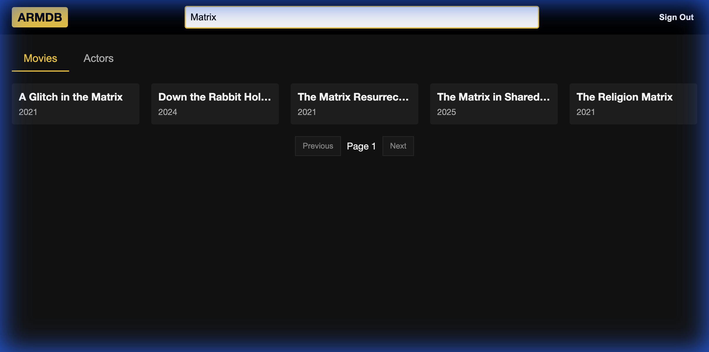
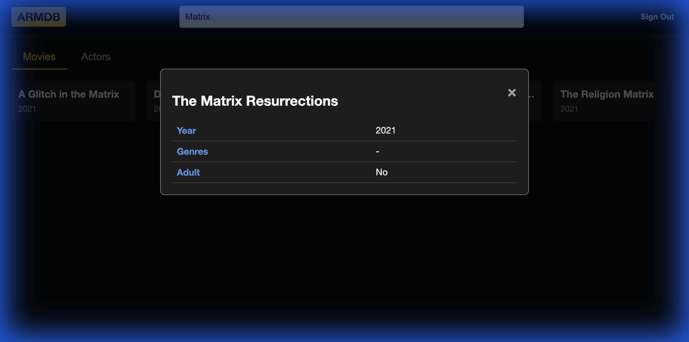
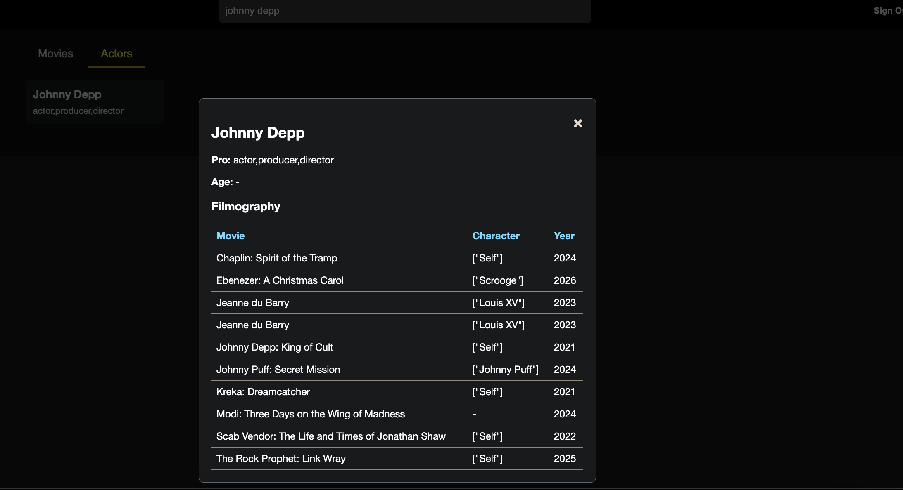

# ArMDb 

ArMDb is a microservices-based application for exploring movies and actors using the IMDb dataset limited to the last 5 years. 
Its goal is to provide low-latency, scalable backend APIs and a simple frontend with basic searching and viewing functionalities.

## Architecture

Built using a Microservices Architecture to ensure scalability, flexibility, and fault isolation.

### Components

The system consists of the following core services:

1.  **Gateway Service** (Port 8080)
    -   **Entry Point**: All client requests go through the Gateway.
    -   **Routing**: Dynamically routes requests to `movie-service` or `auth-service`.
    -   **Rate Limiting**: Uses Redis to limit requests (5 req/min per user) to prevent abuse.
    -   **Authentication**: Validates users via Basic Auth and manages session security.
    -   **Frontend**: Serves the static `index.html` UI.

2.  **Registry Service (Eureka)** (Port 8761)
    -   **Service Discovery**: Allows services to register themselves and discover others dynamically without hardcoded URLs.

3.  **Movie Service** (Port 6001)
    -   **Core Logic**: Manages data for Movies, Actors, and their relationships.
    -   **Database**: Connects to the PostgreSQL database (`armdb`).
    -   **Search**: Implements full-text search for actors and keyword search for movies.

4.  **Auth Service** (Port 5001)
    -   **Security**: Handles user verification and provides user details for the Gateway's auth filter.

### Infrastructure
-   **PostgreSQL**: Relational database storing movie/actor data with optimized indices (GIN for search).
-   **Redis**: In-memory data store used by the Gateway for distributed rate limiting.
-   **Docker**: All services are containerized for consistent deployment.

### Architecture Diagram


## Design


### Why Microservices?
-   **Scalability**: The `movie-service` (expected high read traffic) can be scaled independently of the `auth-service` (lower traffic).
-   **Resilience**: Issues in the Auth service won't crash the Movie catalog functions (though access might be restricted).
-   **Technology Independence**: Different services can evolve with different libraries or Java versions if needed.

### Service Discovery (Eureka)
We use Netflix Eureka for client-side load balancing and decoupling. Services register correctly on startup, allowing the Gateway to route traffic via `lb://service-name` rather than static IPs.

### Gateway & Rate Limiting
A central API Gateway pattern simplifies the client (single endpoint) and offloads cross-cutting concerns:
-   **Security**: Auth is enforced at the edge.
-   **Rate Limiting**: Implemented using **Spring Cloud Gateway RequestRateLimiter** with Redis.

## Dependencies

-   **Java 17 / 21**: Core language.
-   **Spark 3.5.0**: ETL and cleansing of the IMDb dataset
-   **Spring Boot 3.2**: For the microservices.
-   **Spring Cloud Gateway 2023.0.**: Routing and filtering.
-   **Spring Cloud Netflix Eureka**: Service Registry.
-   **Spring Data JPA**: Database abstraction.
-   **PostgreSQL Driver**: DB connectivity.
-   **Testcontainers**: Integration testing with real containers.
-   **OpenAPI (Swagger)**: API documentation.

## How to Run

### Prerequisites
-   Docker & Docker Compose
-   Java 17+
-   Maven

### Quick Start
1.  Clone the repository.
2.  Build the services and/or run the tests
    ```bash
    mvn clean package [-DskipTests]    
    ```
3.  Run the entire stack with Docker Compose:
    ```bash
    docker-compose up --build
    ```
3.  Access the application:
    -   **Frontend/Gateway**: [http://localhost:8080](http://localhost:8080)
    -   **Gateway Swagger**: [http://localhost:8080/swagger-ui/index.html](http://localhost:6001/swagger-ui/index.html)
    -   **Movie Swagger**: [http://localhost:6001/movies/swagger-ui/index.html](http://localhost:6001/swagger-ui/index.html)
    -   **Eureka Dashboard**: [http://localhost:8761](http://localhost:8761)
    -   **Prometheus**:       [http://localhost:9090](http://localhost:9090)
    -   **Grafana**:          [http://localhost:3000](http://localhost:3000) (Admin: `admin` / `admin`)


4. For simplicity, three users are hardcoded in the auth service: 
    ```
    [user1:pass1],   [user2:pass2],   [user3:pass3]
    ```

### Data
-  The database is available at [armdb-backup.tar](https://drive.google.com/file/d/1fAnTBdH-T44LUuAw1GtQ9B7VRRBPfTyC/view?usp=sharing)
-  To restore the db, extract the .tar and run `restore.sql`

## UI 

### Search Results
Search for actors and movies.


### Movie Details


### Appearances

